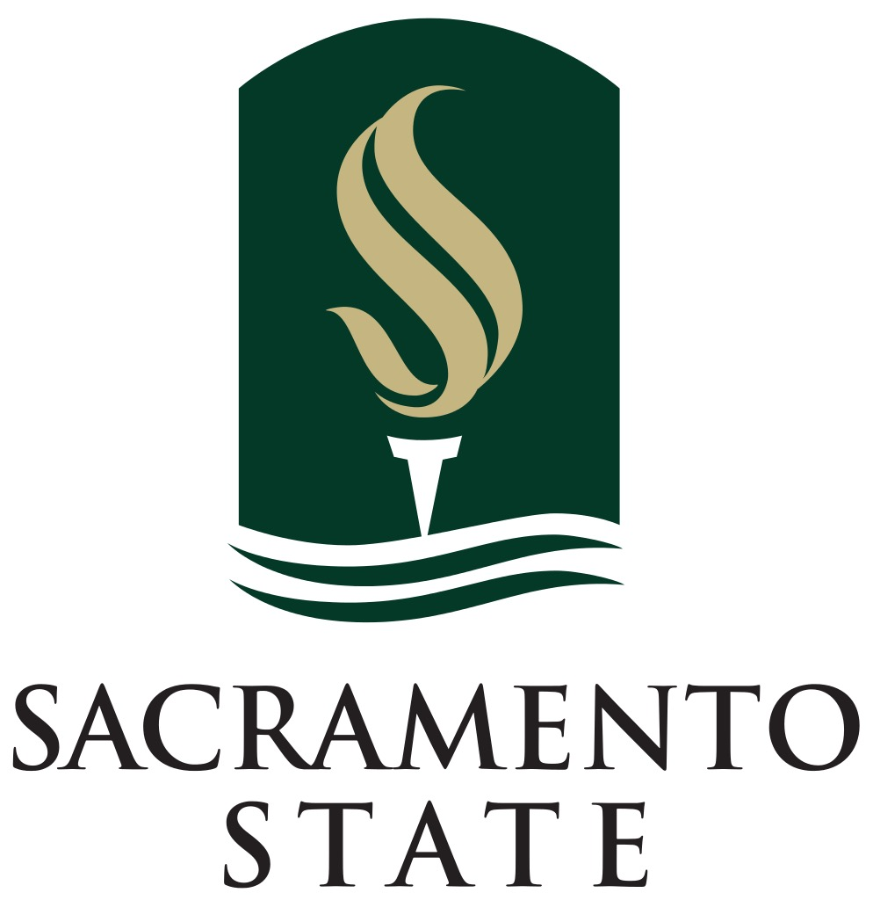

**Team-Awesome**
================

--------------------------------------------------------------------------------

**Project Proposal: Faculty Information Cards**
-----------------------------------------------

For California State University Sacramento, Computer Science Department

Version 2.0 | March 10, 2017

Team Members: Aitken, Connor | Binjola, Devesh | Duan, Cindy |
Hairabedian, Bryce | Newaz, Shah | Wadsworth, Robert

**Reason for this document (To who? And Why?)**

Table of Contents
-----------------

**1. Business Requirements**

**1.1 Background / Current System**

**1.2 Business Opportunity**

**1.3 Business Objectives**

**1.4 Success Metrics**

**1.5 Vision Statement**

**1.6 Business Risks**

**1.7 Business Assumptions and Dependencies**

**2. Scope and Limitations**

**2.1 Major Features**

**2.2 Scope of Initial Release**

**2.3 Scope of Subsequent Release**

**2.4 Limitations and Exclusions**

**3. Business Context**

**3. 1 Stakeholder Profiles**

**3.2 Project Priorities**

**3.3 Deployment Considerations**

**4. Estimate of Cost and Effort**

**4.1 Team Resumes**

**4.2 Product Backlog**

**4.3 Total Work Hours**

**1. Business Requirements**

**1.1 Background / Current System**

> The Computer Science (CS) department must post faculty information
> cards each semester outside the office where they sit. The information
> cards are printed for each semester to include information for the
> faculty member, the courses he/she teaches, and office information
> including location, phone number and times that the faculty member can
> be found there.

**Current System: **

> Persistent information block contained in the upper portion of the
> faculty card is consistent across semester, ex: Fall 2016.
>
> The Middle portion of Course, Section, Days, Time, and Room
> information is manually transferred and entered into Enrollment
> Document by Clerk, currently Alysa.
>
> The Bottom portion of the Faculty card information including Office
> Hours, Office, and Phone is currently entered in manually by the
> Clerk. The information is provided by email from each instructor to
> the Clerk, currently Alysa.

**1.2 Business Opportunity**

> A new software system should be designed and implemented that will
> ease the administrative burden required to produce the printed Faculty
> Information Cards. The system needs to be usable by staff without
> requiring a high degree of technical skills. The software should be
> generalized so that it may be easily migrated or scaled to other
> departments, campuses or schools.
>
> The software is intended for internal department. Optionally, other
> departments may utilize the system but will be required to have their
> own administrator and clerk. Any administrator would be able to set up
> their own clerk, create another department and grant authority to the
> admin or reset another admin's password.
>
> The new system can streamline some of the administrative overhead by
> allowing faculty to access the system and enter their own office hours
> as well as automate the ETL process when downloading the schedule data
> from Space Management.

**1.3 Business Objectives**

> The business objective is to create an automated tool where it takes
> the required information from a database system and use that
> information to generate faculty information cards.

**1.4 Success Metrics**

> ***Acceptance criteria 1***: The system should includes the automation
> of the necessary information being printed into all the cards using
> information provided by the user.
>
> ***Acceptance criteria 2***: The system should also be capable of
> printing a single card upon request.
>
> ***Acceptance criteria 3*:** The information about a faculty member
> should only be changeable by the office administrator.
>
> ***Acceptance criteria 4***: The entry of faculty office hours and the
> viewing of all information is allowed for the clerk.

#### **Bonus acceptance criteria**

-   System would allow the generation of new semester based on the
    > information from the prior semester and keep both in the database.

-   System would allow the system to print cards for departments other
    > than just the CS department.

-   Each department has its own administrator and clerk

-   Only an administrator can setup a clerk

-   Each administrator can setup an academic department and grant
    > authorities

-   No administrator should be able to see the data of a different
    > department

**1.5 Vision Statement**

> To create a user-friendly automated software that helps CS faculty
> administration generate accurate faculty information cards.
>
> *Desired End-State*: A sleek software tool that helps the CSUS faculty
> administration create information cards.

**1.6 Business Risks**

> No business risks have been identified for the implementation of this
> system. If the system is adopted, having a single admin is a potential
> single point of failure. The system should consist of a global
> administrator(s), application administrator(s), and user(s) for a more
> robust management framework.

**1.7 Business Assumptions and Dependencies**

-   It is assumed the the department will have an office administrator
    > who will approve changes made to faculty member information. The
    > system therefore is dependent on having an application
    > administrator.

-   The department must have a printer in order to print the faculty
    > office hour cards.

-   It is assumed that the department has the necessary technology
    > infrastructure to host a database and the administrators necessary
    > to support the environment this application will run within.

-   The application administrator or clerk depend on faculty members to
    > submit changes to their information.

-   The application administrator or clerk depend on information about
    > the assignment of classrooms.

**2. Scope and Limitations**

**2.1 Major Features**

> Elevator Pitch: A partially automated Faculty card system for the
> Department of Computer Science California State University Sacramento.
>
> Capable of housing all pertaining information relating to the Faculty
> Card per each faculty member, updating or creation of new
> faculty/class information, and the actul printing of the faculty card
> after such information has been verified by all parties.
>
> Parties, Users include Computer Science Department (currently Veronica
> Pruitt & Andrew), Instructor, ABA(Administration & Business Affairs),
> and Admin to the system.

**2.2 Scope of Initial Release**

**Users**

-   Computer Science Department

-   Instructor

-   System Admin

### **Initial Release**

> The initial release will consist of a large subset of desired
> features. These features are provided in terms of User Story epics
> that convey the scope of work to be considered "Done."

-   As a *Computer Science Department* I need to be able to Print the
    > Faculty Cards so that I can deliver current, correct, and
    > up-to-date schedules for students and colleges to see.

-   As an *Instructor* I need to be able to Update my Faculty Card
    > information so that I can provide students with up-to-date
    > information.

-   As a *System Admin* I need to be able to alter how the system works
    > so that the Faculty Card system can adapt to change or resolve any
    > issues that may arise.

**2.3 Scope of Subsequent Release**

Deliverables to be deferred in initial release

-   Option to provide multiple rooms per Course-Section

-   Custom Stylizing of Card per Instructor

-   System Metrics and Measurements per Faculty Card

-   Option to include email under "Office Phone" for more contact
    > options

-   Print from desk option for Instructor

**2.4 Limitations and Exclusions**

> The option to create multiple academic is not planned for this release
> but will be an additional feature in future releases.

**3. Business Context**

**3. 1 Stakeholder Profiles**

> Office Administrator (Reyna) - Downloads class schedule data from
> Space Management (ABA) and transfers to local database (ETL). Receives
> office hour information by email and enters this information into the
> database.
>
> Clerk (Alysia) - Pulls data from local database and uses Microsoft
> Word mail merge to prepare the Faculty Information Cards for printing.
>
> Computer Science Department Faculty - Notifies Veronica Pruitt by
> email of office hours.
>
> Students - Relies on faculty information cards to get meet with
> faculty for help outside of class.
>
> IT Staff - There may or may not be IT staff required to install
> faculty information card software, setup/maintain database and
> maintain respective servers.

**3.2 Project Priorities**

-   **Features**: all features scheduled for release 1.0 must be fully
    > completed, and matches all the functional requirements.

-   **Quality**: Have to pass 97% of user acceptance tests, (including:
    > login, security, functions, and system performance tests).

-   **Schedule**: Phase 1 of project are scheduled to be available on 20
    > May, 2017. Overrun of up to 2 weeks acceptable without sponsor
    > approval.

-   **Cost**: +15% budgets difference are acceptable without sponsor
    > review. Project manager is responsible for communicating and
    > review the expenses with financial department of cost business
    > unit.

-   **Staff**: total team size is six team members: 2 developers,
    > half-time tester, 1 project manager will have 50% of time for
    > project management, half-time for Business Analyst. Additional 1
    > member can be borrowed from other team if necessary during the
    > project period. Team members will be encouraged to wrap up a
    > strong, high quality program in order to leave enough time to
    > carefully plan a well-structured, and prepare for system go-live,
    > and problem solving.

-   **Change Management**: any requirements changes request by customer,
    > project manager is responsible to communicate with related teams,
    > and set up meeting to address it. Any adjusts cost up to 40 man
    > hours. Project manager has to submit additional resource request,
    > and signature by project manager of client. Project manager is
    > responsible to communicate with market department if there is any
    > cost outside of contract.

**3.3 Deployment Considerations**

> The Oracle database 12.12 is required to be installed on the database
> server, and apple browser and windows explore need to be upgraded to
> the newest version on the web server. Application server have to be
> ready one day before promote all the program objects from test
> environment to production. One additional backup printer has to be
> ready for print the faculty information cards.

**4. Estimate of Cost and Effort**

**4.1 Team Resumes**

**Bryce Hairabedian**

-   Education

    -   B.S., Computer Science, Sacramento State

-   Experience

    -   Web Developer: Aerojet Rocketdyne

    -   Advanced Repair Agent: Geek Squad

-   Skills

    -   Languages: Java, JavaScript, C/C++, PHP, MySQL

    -   Methodologies: Agile, Scrum, Iterative

    -   Tools: Git, Linux, Spring, Eclipse, Photoshop, Illustrator

> **Shah Newaz**

-   Education

    -   B.S., Computer Science, Sacramento State

-   Experience

    -   Web Developer: Vision Service Prover

    -   Competitive Programming : Ludem Dare, ICPC, Major League
        > Hacking, Top Coder

-   Skills

    -   Languages: Html, Java, JavaScript, Typescript, C/C++/C\#, MySQL

    -   Framework: Angular2, Codename one, Gamemaker, Unity

    -   Methodologies: Agile, Scrum, Iterative

    -   Tools: Git, Linux, Eclipse, Unity, WebStorm, InteliJ, Jira,
        > Slack, Sublime

### **Connor Aitken**

-   Education

    -   B.S. Computer Science (in progress)

-   Experience

    -   Managed services Consultant

    -   Internet of Things researcher

    -   Web Application consultant

    -   Radio/wireless network engineer

-   Skills

    -   Languages: Python, C/C++, javascript

    -   Systems Administration: linux, Windows, MacOS, VMware

    -   Networking: Cisco IOS, Ubiquiti Unifi, fortigate, xbee/zigbee

    -   Frameworks: Flask, Django, Pyramid, Node-RED,

    -   Tools: git/github, Unifi controller, Netmiko(python netwokring
        > automation)

### **Robert Wadsworth**

-   Education

    -   B.S., Computer Science, Sacramento State

-   Experience

    -   STG/USDA - Software Developer

    -   Intel - Software Engineering Intern

    -   CalPERS - Technical Assistant

-   Skills

    -   Languages: Perl, MySQL, HTML 5, CSS, JavaScript, C\#.NET, Java,
        > Python

    -   Systems Administration: linux, Windows, MacOS

    -   Frameworks: Catalyst, Django, jQuery, Angular

    -   Tools: subversion, git/github, eclipse, Visual Studio

### **Devesh Binjola**

-   Education

    -   B.S., Computer Science, Sacramento State

-   Experience

    -   Computer Science Intern: PowerSchool Group

    -   AWS Certified Developer - Associate

    -   AWS Certified Solutions Architect - Associate

-   Skills

    -   Languages: Python, Java,C/C++/C\#, MySQL

### **Cindy Duan**

-   Education

    -   B.S., Computer Science, Sacramento State

-   Experience

    -   worked in IT field more than 10 years for Oracle Partner and international companies, started from Programmer, System Analyst, Project Manager, Asian Pacific IT Manager and Oracle Consultant for Asia countries.

-   Skills

    -   Oracle ERP Implementation
        - SD (Sales/Procurement/Logistics/Inventory)
        - CRM
        - MRP/MPS/DRP
        - SFC/Finance(AR/AP/FA/Job Cost)/Project
    -   Database Systems
        - Oracle 9.10.11
        - Microsoft Server
        - AS400/DB2/400/SQL/RPG/LE/CL/Cobol/SDA/DDS/RLU/SEU/SQL
        - JDE/BI App/Hyperion/Agile/EBS
    

    -   Web: React.JS, Node.JS, HTML, CSS, JavaScript, jQuery, Gulp,
        > Grunt, .NET

    -   Methodologies: Agile, Scrum

    -   Tools: Git, Linux, Eclipse, InteliJ, Jira, Slack, Sublime

**4.2 Product Backlog**

Our Product Backlog below is organized according to priority set by
Product Owner.

  **Priority**   **Sprint**   **Feature / Story / Item**
  -------------- ------------ ------------------------------------------------------------------------------------------------------------------------
  1              1            Get/pull class schedule data from Space Management (ABA) populate database automatically for the Office administrator.
  2              2            Create web interface for Instructors to be able to upload Office Hours, Office Room, Email.
  3              2            Present class schedule data on a web interface for the Office Administrator (Reyna.)
  4              3            Create view for individual faculty member to edit/add/remove information during current semester.
  5              3            Automated print feature upon change to any faculty member information.

**4.3 Total Work Hours**

> The estimated total hours worked is per person per week basis. Six
> total team members expected to contribute at roughly six hours per
> week. And a strict deliverable date of May 15th currently leaves ten
> weeks remaining. Resulting in 360 estimated hours to be worked by Team
> Awesome.
